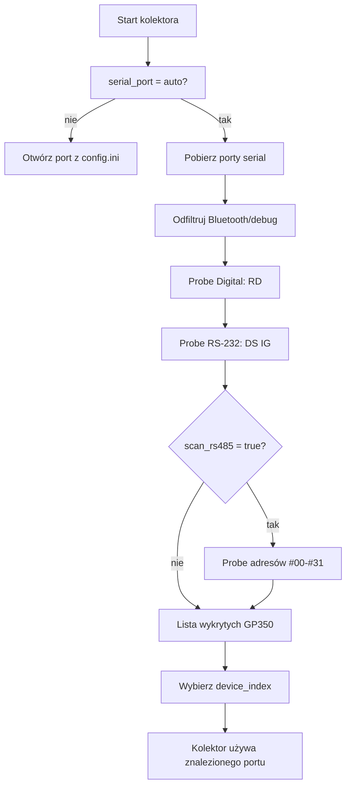

# Autodetekcja urządzeń serial

Cel: kolektor sam znajduje GP350 podłączone przez adaptery USB-RS232/USB-Serial.
Na razie wykrywamy tylko GP350. Turbo-V 81-AG i Turbo-V 551 HT zostają jako
przyszłe profile urządzeń.

## Co robi skaner

1. Pobiera listę portów z `pyserial`.
2. Pomija porty typu Bluetooth/debug.
3. Na macOS wybiera `/dev/cu.*` zamiast bliźniaczego `/dev/tty.*`.
4. Próbuje bezpieczne komendy odczytu:
   - Digital Interface: `RD`
   - RS-232 Module: `DS IG`
5. Jeśli włączysz RS-485, próbuje też `#00RD` ... `#31RD`.
6. Jeśli odpowiedź wygląda jak ciśnienie GP350, zapisuje port i ustawienia.



## Jak zobaczyć wykryte urządzenia

```bash
uv run python -m collectors.gp350_collector --discover
```

Przykład:

```text
[0] type=gp350 module=digital port=/dev/cu.usbserial-A baudrate=9600 confidence=1.00 raw='1.23E-06'
[1] type=gp350 module=digital port=/dev/cu.usbserial-B baudrate=9600 confidence=1.00 raw='4.56E-06'
```

## Dwa kontrolery GP350

Najprostszy układ: dwa procesy kolektora, dwa indeksy.

```bash
uv run python -m collectors.gp350_collector --auto-device-index 0
uv run python -m collectors.gp350_collector --auto-device-index 1
```

W praktyce lepiej zrobić dwa configi:

- `config/gp350_chamber.ini`: `device_index = 0`, `device_name = GP350_CHAMBER`
- `config/gp350_loadlock.ini`: `device_index = 1`, `device_name = GP350_LOADLOCK`

Każdy config może mieć osobny CSV, tag `device` w InfluxDB i osobny panel w
Grafanie.

## Ustawienia w config.ini

```ini
[Connection]
module_type = auto
serial_port = auto

[Detection]
device_index = 0
probe_timeout = 0.35
scan_rs485 = false
rs485_addresses = 0-31
```

Znaczenie:

- `module_type = auto` - skaner sam rozpoznaje `digital` albo `rs232`.
- `serial_port = auto` - skaner sam wybiera port.
- `device_index` - który wykryty GP350 ma obsługiwać ten kolektor.
- `probe_timeout` - krótki timeout dla pojedynczej próby.
- `scan_rs485` - dodatkowy wolniejszy scan adresów RS-485.
- `rs485_addresses` - adresy do próbowania, np. `0-31` albo `1,2`.

## Granica bezpieczeństwa

Autodetekcja GP350 wysyła tylko komendy odczytu. Nie wysyła:

- `DG ON`
- `IG1 ON`
- `IG2 ON`
- komend Turbo-V
- żadnych komend sterujących pompą

Turbo-V później powinny dostać osobne profile typu:

```text
devices/gp350.py
devices/turbov81.py
devices/turbov551.py
```

Wtedy skaner może rozpoznawać wiele rodzin urządzeń bez mieszania protokołów.
