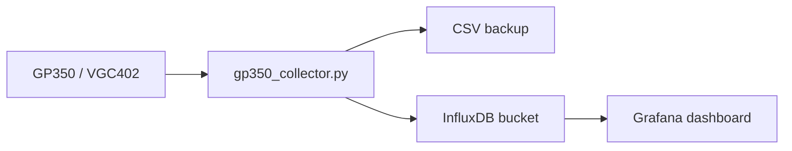

# InfluxDB + Grafana

Kolektor może pisać równolegle do CSV i InfluxDB v2. Grafana potem czyta bucket
InfluxDB i rysuje wykresy.



## 1. Przygotuj InfluxDB

W InfluxDB v2 utwórz:

- organization, np. `lab`
- bucket, np. `vacuum`
- API token z prawem write do bucketu

Token najlepiej trzymać w env:

```bash
export INFLUXDB_TOKEN="..."
```

## 2. Config kolektora

W `config/config.ini`:

```ini
[InfluxDB]
enabled = true
url = http://localhost:8086
org = lab
bucket = vacuum
token =
token_env = INFLUXDB_TOKEN
measurement = vacuum_pressure
timeout = 2.0
retries = 1
fail_on_error = false
```

`fail_on_error = false` oznacza: gdy InfluxDB chwilowo padnie, kolektor nadal
zapisuje CSV i loguje błąd InfluxDB.

`retries` dotyczy awarii transportu, HTTP `429` i HTTP `5xx`. Błędy trwałe
HTTP `4xx`, np. `401` dla złego tokenu, kończą próbę od razu.

## 3. Dane w InfluxDB

Measurement:

```text
vacuum_pressure
```

Tagi:

- `device`
- `channel`
- `quality`
- `device_type`
- `module_type`
- `command`

Fields:

- `pressure_torr`
- `latency_ms`
- `raw_response`
- `is_good`
- `unit`
- `gauge_status`

Przykładowy line protocol:

```text
vacuum_pressure,device=GP350_1,channel=IG1,quality=good,device_type=gp350,module_type=digital,command=RD pressure_torr=1.23e-06,latency_ms=12.346,raw_response="1.23E-06",is_good=true,unit="Torr" 1782302400000000000
```

## 3a. Grafana Cloud zamiast własnego InfluxDB

Grafana Cloud przyjmuje line protocol na hoście Prometheusa i wymaga Basic
auth zamiast tokenu InfluxDB v2. Dane trafiają wtedy do Mimira jako metryki,
nie do bazy InfluxDB.

```ini
[InfluxDB]
enabled = true
url = https://prometheus-prod-NN-prod-REGION.grafana.net
username = 1234567
write_path = /api/v1/push/influx/write
token_env = INFLUXDB_TOKEN
measurement = vacuum_pressure
```

`username` to numer instancji z Cloud Portal; ustawienie go przełącza writer
na Basic auth. `org` i `bucket` zostają wtedy puste - Grafana Cloud ustala
cel z samych poświadczeń.

Nazwy metryk powstają jako `<measurement>_<pole>`:

```text
vacuum_pressure_pressure_torr
vacuum_pressure_latency_ms
vacuum_pressure_is_good
```

Pola tekstowe (`raw_response`, `unit`, `gauge_status`) nie tworzą osobnych
metryk Prometheus. Znane, ograniczone wartości `gauge_status` są dodatkowo
wysyłane jako label każdej metryki, np. `gauge_status="sensor_off"`. Dowolny
tekst nigdy nie staje się labelem, więc nie zwiększa niekontrolowanie
cardinality. W CSV pola zostają kompletne. Zapytania pisz w PromQL, nie we
Fluxie.

## 4. Grafana query

Panel ciśnienia:

```flux
from(bucket: "vacuum")
  |> range(start: -6h)
  |> filter(fn: (r) => r._measurement == "vacuum_pressure")
  |> filter(fn: (r) => r._field == "pressure_torr")
  |> filter(fn: (r) => r.quality == "good")
```

Panel latency:

```flux
from(bucket: "vacuum")
  |> range(start: -6h)
  |> filter(fn: (r) => r._measurement == "vacuum_pressure")
  |> filter(fn: (r) => r._field == "latency_ms")
```

Panel błędów:

```flux
from(bucket: "vacuum")
  |> range(start: -6h)
  |> filter(fn: (r) => r._measurement == "vacuum_pressure")
  |> filter(fn: (r) => r._field == "is_good")
  |> filter(fn: (r) => r._value == false)
```

## 5. Grafana panele

Dwa gotowe dashboardy, zależnie od tego, gdzie trafiają dane:

| Plik | Dla kogo | Język zapytań |
| --- | --- | --- |
| `grafana/vacuum-dashboard.json` | własny InfluxDB v2 | Flux |
| `grafana/vacuum-dashboard-prometheus.json` | Grafana Cloud | PromQL |

Wersja dla Grafana Cloud sama wykrywa podłączone przyrządy: zmienne
`Urządzenie` i `Kanał` czytają etykiety z metryk, a panel ciśnienia jest
powtarzany dla każdego urządzenia. Dwa GP350 i dwa VGC402 nie wymagają
żadnej zmiany w dashboardzie - dojdą same, gdy zaczną wysyłać dane.

Import:

1. Dashboards -> New -> Import
2. Wgraj wybrany plik JSON
3. Wybierz data source (Prometheus dla Grafana Cloud, InfluxDB dla własnej bazy)

Import:

1. Grafana Cloud -> Dashboards -> New -> Import.
2. Wgraj `grafana/vacuum-dashboard.json`.
3. Wybierz datasource InfluxDB.
4. Ustaw zmienną `bucket`, domyślnie `vacuum`.
5. Ustaw zmienną `measurement`, domyślnie `vacuum_pressure`.

Panele w dashboardzie:

- `Pressure Torr` - time series, field `pressure_torr`, skala logarytmiczna.
- `Latency ms` - time series, field `latency_ms`.
- `Quality` - stat/table po tagu `quality`.
- `Raw response` - table z `raw_response` do debugowania.

Alerty:

```text
grafana/alert-rules.md
```

Zawiera gotowe Flux query dla:

- brak danych z kolektora,
- `quality != good`,
- `sensor_off`,
- `bpg_bcg_hpg_error`.

## 6. Troubleshooting

Brak danych:

- sprawdź `enabled = true`
- sprawdź `INFLUXDB_TOKEN`
- sprawdź `org` i `bucket`
- sprawdź `logs/collector.log`

HTTP `401`:

- token zły albo bez prawa write.

HTTP `404`:

- zły bucket albo org.

CSV działa, Influx nie:

- to normalne przy `fail_on_error = false`; kolektor nie przerywa pomiarów.
