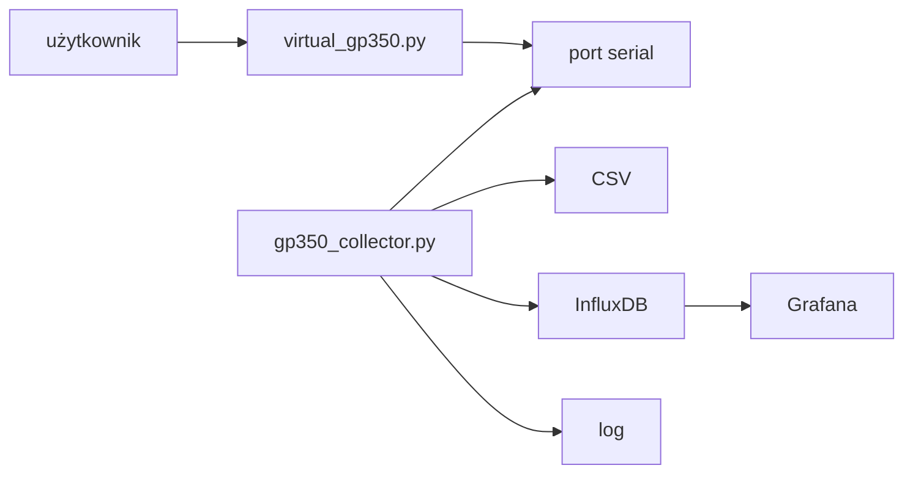
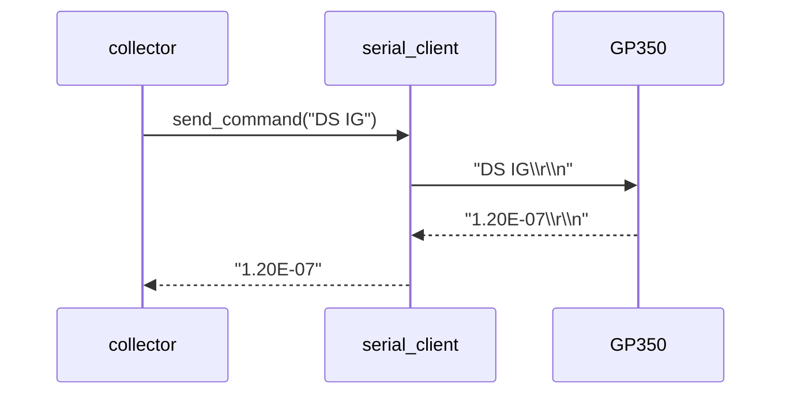
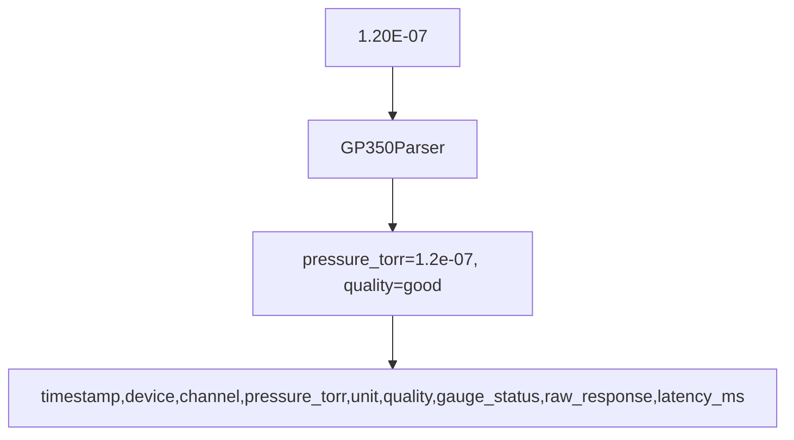
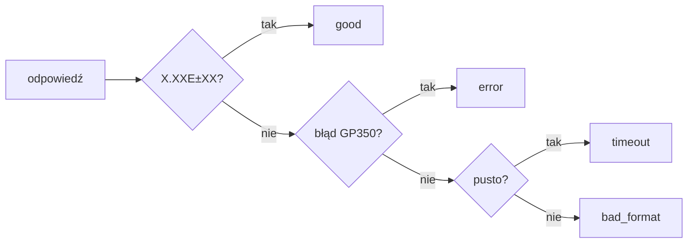
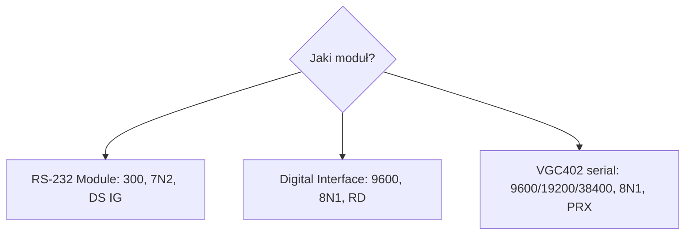

# Jak działa projekt GP350

Projekt ma dwa światy:

- `virtual_gp350.py` - symuluje port serial i odpowiada jak GP350.
- `collectors/gp350_collector.py` - czyta ciśnienie z portu, zapisuje CSV i
  opcjonalnie InfluxDB pod Grafanę.



## Protokół zgodny z manualem

Najważniejsze: `DGS` nie jest pomiarem ciśnienia.

| Komenda | Znaczenie | Przykład odpowiedzi |
| --- | --- | --- |
| `DS IG` | odczyt ciśnienia RS-232 Module | `1.20E-07` |
| `RD` | odczyt ciśnienia Digital Interface | `1.20E-07` albo `* 1.20E-07` |
| `DGS` | status degas | `0` albo `1` |
| `DG ON` | włącz degas | `OK` albo `INVALID` |
| `DG OFF` | wyłącz degas | `OK` |
| `IG1 ON/OFF` | filament 1 | `OK` albo `INVALID` |
| `IG2 ON/OFF` | filament 2 | `OK` albo `INVALID` |
| `IGB` | status filamentów | `00`, `01`, `10`, `11` |
| `F1 1/F1 0` | cyfrowe sterowanie filamentem 1 | `11G1 ON`, `01G1 OFF` |
| `F2 1/F2 0` | cyfrowe sterowanie filamentem 2 | `12G2 ON`, `02G2 OFF` |
| `PC S` | status process control | `0000` |
| `PC B` | status process control jako bajt | `@` |

## Odczyt ciśnienia



Parser przyjmuje format:

```text
X.XXE±XX
```

Przykłady:

```text
1.20E-07
9.90E+09
```

`9.90E+09` oznacza brak poprawnego odczytu, np. ion gauge off albo start po
włączeniu. Kolektor zapisuje to jako `quality=error`.

## CSV



Kolumny:

```text
timestamp,device,channel,pressure_torr,unit,quality,gauge_status,raw_response,latency_ms
```

`gauge_status` jest puste dla GP350 i ma wartości typu `ok`, `sensor_off`,
`overrange`, `bpg_bcg_hpg_error` dla urządzeń, które zwracają status kanału,
np. VGC402.

## Stany jakości



## Ustawienia portu



W configu:

```ini
[Connection]
module_type = digital
baudrate = 9600
bytesize = 8
parity = none
stopbits = 1
line_terminator = cr
rs485_address =

[Collector]
command = RD
```

Jeśli `command` albo parametry serial nie są podane, kolektor dobiera defaulty z
`module_type`.

Dla VGC402 zalecane jest `command = PRX` i `pressure_unit = auto`. Kolektor
wysyła wtedy `UNI`, ustala jednostkę z kontrolera i zapisuje osobne rekordy
`CH1`, `CH2`.

RS-485 z adresem:

```ini
[Connection]
module_type = digital
rs485_address = 1
```

Kolektor wyśle `#01RD`, parser przyjmie `* 1.20E-07`.

## Awaria i błędy

Manualowe błędy:

```text
OVERRUN ERROR
PARITY ERROR
SYNTAX ERROR
INVALID
? SYNTX ER
? PRITY ER
? OVERR ER
? RAM FAIL
? INVALID
```

Kolektor nie crashuje od pojedynczego błędu. Zapisuje rekord z `quality=error`
albo `bad_format`, loguje problem i idzie dalej.
