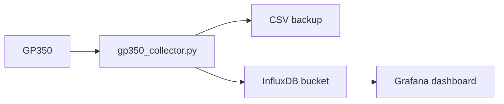

# InfluxDB + Grafana

Kolektor może pisać równolegle do CSV i InfluxDB v2. Grafana potem czyta bucket
InfluxDB i rysuje wykresy.



## 1. Przygotuj InfluxDB

W InfluxDB v2 utwórz:

- organization, np. `lab`
- bucket, np. `gp350`
- API token z prawem write do bucketu

Token najlepiej trzymać w env:

```bash
export INFLUXDB_TOKEN="..."
```

## 2. Config kolektora

W `config/config.ini`:

```ini
[InfluxDB]
enabled = true
url = http://localhost:8086
org = lab
bucket = gp350
token =
token_env = INFLUXDB_TOKEN
measurement = gp350_reading
timeout = 2.0
retries = 1
fail_on_error = false
```

`fail_on_error = false` oznacza: gdy InfluxDB chwilowo padnie, kolektor nadal
zapisuje CSV i loguje błąd InfluxDB.

## 3. Dane w InfluxDB

Measurement:

```text
gp350_reading
```

Tagi:

- `device`
- `channel`
- `quality`
- `module_type`
- `command`

Fields:

- `pressure_torr`
- `latency_ms`
- `raw_response`
- `is_good`
- `unit`

Przykładowy line protocol:

```text
gp350_reading,device=GP350_1,channel=IG1,quality=good,module_type=digital,command=RD pressure_torr=1.23e-06,latency_ms=12.346,raw_response="1.23E-06",is_good=true,unit="Torr" 1782302400000000000
```

## 4. Grafana query

Panel ciśnienia:

```flux
from(bucket: "gp350")
  |> range(start: -6h)
  |> filter(fn: (r) => r._measurement == "gp350_reading")
  |> filter(fn: (r) => r._field == "pressure_torr")
  |> filter(fn: (r) => r.quality == "good")
```

Panel latency:

```flux
from(bucket: "gp350")
  |> range(start: -6h)
  |> filter(fn: (r) => r._measurement == "gp350_reading")
  |> filter(fn: (r) => r._field == "latency_ms")
```

Panel błędów:

```flux
from(bucket: "gp350")
  |> range(start: -6h)
  |> filter(fn: (r) => r._measurement == "gp350_reading")
  |> filter(fn: (r) => r._field == "is_good")
  |> filter(fn: (r) => r._value == false)
```

## 5. Grafana panele

Prosty dashboard:

- `Pressure Torr` - time series, field `pressure_torr`, skala logarytmiczna.
- `Latency ms` - time series, field `latency_ms`.
- `Quality` - stat/table po tagu `quality`.
- `Raw response` - table z `raw_response` do debugowania.

## 6. Troubleshooting

Brak danych:

- sprawdź `enabled = true`
- sprawdź `INFLUXDB_TOKEN`
- sprawdź `org` i `bucket`
- sprawdź `logs/collector.log`

HTTP `401`:

- token zły albo bez prawa write.

HTTP `404`:

- zły bucket albo org.

CSV działa, Influx nie:

- to normalne przy `fail_on_error = false`; kolektor nie przerywa pomiarów.
