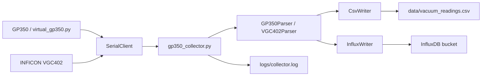
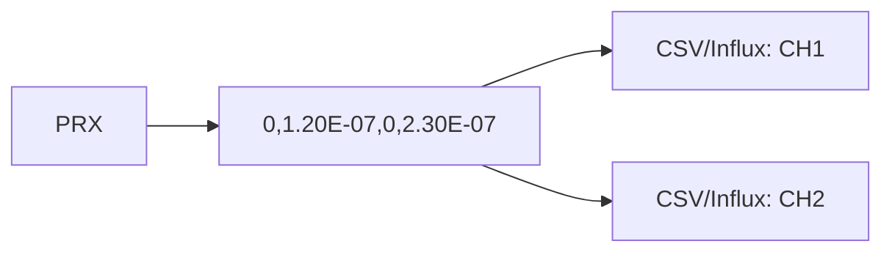
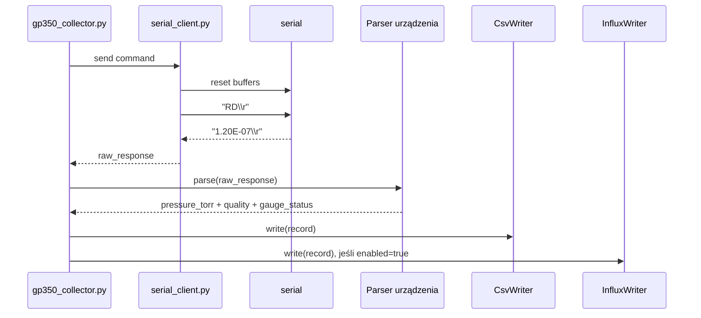
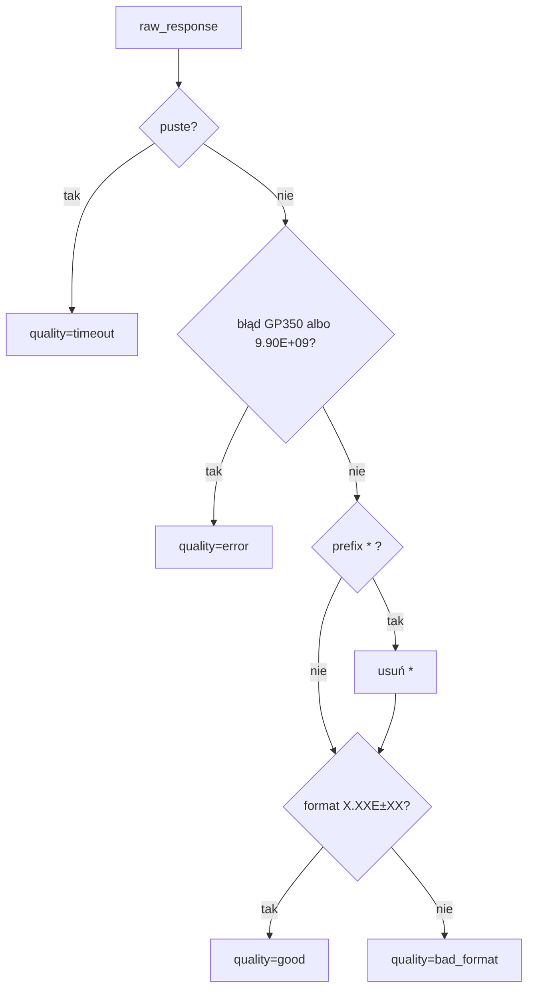
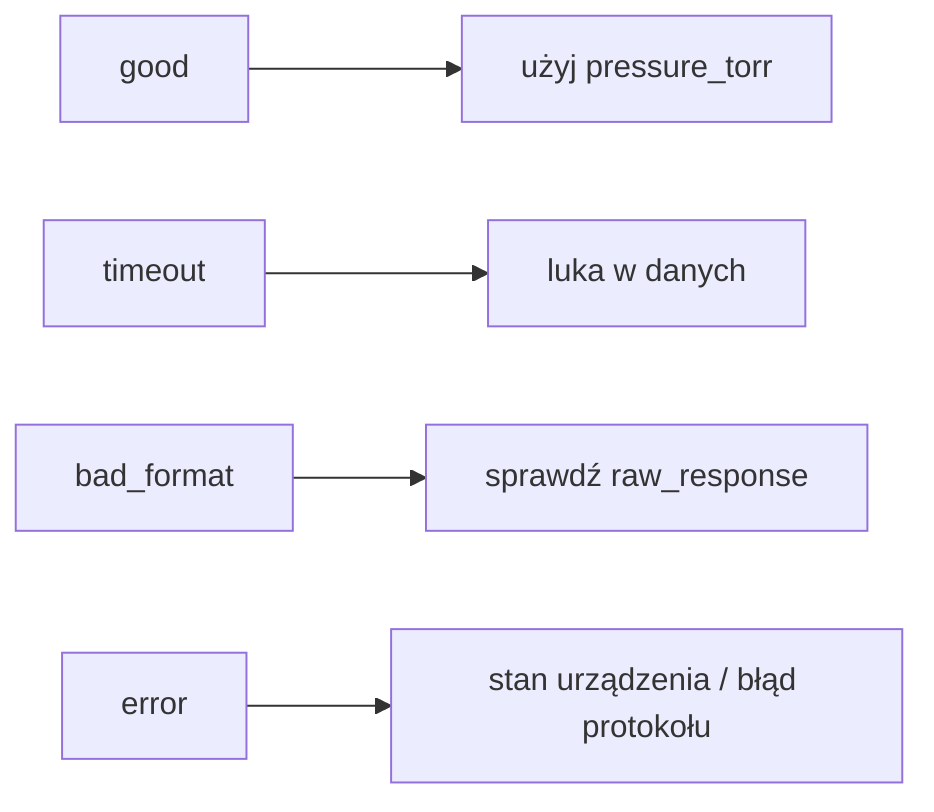
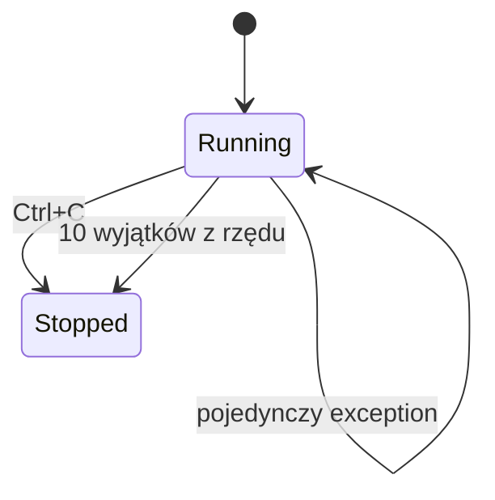

# Kolektor danych - jak działa

Kolektor pyta urządzenie o ciśnienie komendą zgodną z instrukcją, mierzy czas
odpowiedzi, parsuje ASCII i zapisuje wynik do CSV oraz opcjonalnie InfluxDB.



## Komenda pomiarowa

Komenda zależy od `module_type`:

```text
module_type = auto    -> autodetekcja: digital, rs232 albo serial
module_type = rs232   -> DS IG
module_type = digital -> RD
module_type = serial  -> PR1, PR2 albo PRX dla VGC402
```

`DS IG` jest dla RS-232 Module. `RD` jest dla Digital Interface. Odpowiedź ma
postać samej liczby albo liczby z prefixem `*` przy RS-485:

```text
1.20E-07
```

Bez jednostki, bez statusu `ON`, bez przecinka.

`DGS` nie jest pomiarem. `DGS` zwraca status degas: `1` albo `0`.

INFICON VGC402 działa inaczej:

```text
PR1\r\n -> ACK
ENQ     -> 0,1.20E-07\r\n
```

`PR1` czyta kanał 1, `PR2` kanał 2. `PRX` czyta wszystkie kanały jednym
zapytaniem:

```text
PRX\r\n -> ACK
ENQ     -> 0,1.20E-07,0,2.30E-07\r\n
```

Pierwsza liczba w każdej parze to status kanału, druga to ciśnienie w
jednostce ustawionej na kontrolerze. Gdy `pressure_unit = auto`, kolektor przy
starcie wysyła `UNI`, odczytuje jednostkę z urządzenia i dopiero potem mierzy.



## Pętla kolektora



## Konfiguracja serial

```ini
[Connection]
module_type = auto
serial_port = auto
baudrate = 9600
bytesize = 8
parity = none
stopbits = 1
line_terminator = cr
rs485_address =
timeout = 1.0
write_timeout = 1.0

[Detection]
device_index = 0
probe_timeout = 0.35
scan_rs485 = false
rs485_addresses = 0-31
```

Manual GP350 dopuszcza:

- `baudrate`: `75`, `150`, `300`, `600`, `1200`, `2400`, `4800`, `9600`, `19200`
- `bytesize`: `7` albo `8`
- `parity`: `none`, `even`, `odd`
- `stopbits`: `1` albo `2`
- `line_terminator`: `crlf`, `cr` albo `lf`

Manual INFICON VGC402 dopuszcza `baudrate`: `9600`, `19200`, `38400`.

Starszy RS-232 Module fabrycznie: `300`, `7`, `none`, `2`.
Digital Interface fabrycznie: `9600`, `8`, `none`, `1`, terminator `CR`.

Jeśli usuniesz `baudrate`, `bytesize`, `parity`, `stopbits` albo `command`,
kolektor dobierze wartości z `module_type`.

Jeśli ustawisz `module_type = auto` i `serial_port = auto`, kolektor najpierw
wykona autodetekcję. Szczegóły: `docs/autodetekcja_urzadzen.md`.

RS-485:

```ini
[Connection]
module_type = digital
rs485_address = 1

[Collector]
command = RD
```

Kolektor wyśle wtedy:

```text
#01RD
```

## Parser



Obsługiwane poprawne odczyty:

```text
1.20E-07
* 1.20E-07
```

Obsługiwane błędy urządzenia:

```text
9.90E+09
OVERRUN ERROR
PARITY ERROR
SYNTAX ERROR
INVALID
? SYNTX ER
? PRITY ER
? OVERR ER
? RAM FAIL
? INVALID
```

## CSV

Nagłówek:

```text
timestamp,device,channel,pressure_torr,unit,quality,gauge_status,raw_response,latency_ms
```

Przykład GP350:

```text
2026-06-24T12:00:00+00:00,GP350_1,IG1,1.2e-07,Torr,good,,1.20E-07,12.346
```

Przykład VGC402:

```text
2026-06-24T12:00:00+00:00,VGC402_1,CH1,1.2e-07,Torr,good,ok,"0,1.20E-07",14.120
```

Przykład VGC402 z `PRX`:

```text
2026-06-24T12:00:00+00:00,VGC402_1,CH1,1.2e-07,Torr,good,ok,"0,1.20E-07,0,2.30E-07",14.120
2026-06-24T12:00:00+00:00,VGC402_1,CH2,2.3e-07,Torr,good,ok,"0,1.20E-07,0,2.30E-07",14.120
```

`pressure_unit = auto` jest zalecane dla VGC402. Kolektor używa wtedy `UNI` i
rozpoznaje: `mbar`, `Torr`, `Pa`, `micron`. Wynik i tak zapisuje jako
`pressure_torr`.

## InfluxDB dla Grafany

CSV zostaje lokalnym backupem. InfluxDB jest opcjonalnym drugim outputem pod
Grafanę.

Minimalny config:

```ini
[InfluxDB]
enabled = true
url = http://localhost:8086
org = lab
bucket = vacuum
token_env = INFLUXDB_TOKEN
measurement = vacuum_pressure
```

Szczegóły: `docs/influxdb_grafana.md`.

## Jakość rekordu



Znaczenie:

- `good`: poprawny odczyt ciśnienia.
- `timeout`: brak odpowiedzi.
- `bad_format`: odpowiedź nie pasuje do manualowego formatu ciśnienia.
- `error`: GP350 zwrócił błąd albo `9.90E+09`; VGC402 zwrócił status kanału
  inny niż `0`, np. `7 = bpg_bcg_hpg_error`.

## Odporność

Pojedynczy zły pomiar nie zatrzymuje kolektora.



Przy zamkniętym porcie kolektor loguje wyjątek, próbuje dalej i kończy po
`10` błędach z rzędu.
