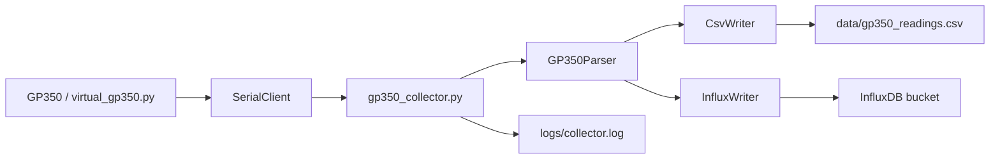
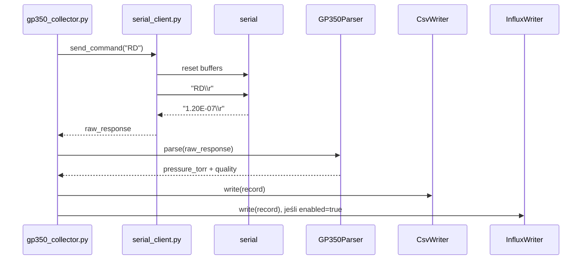
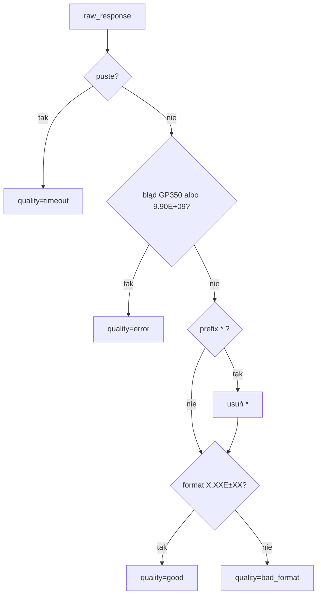
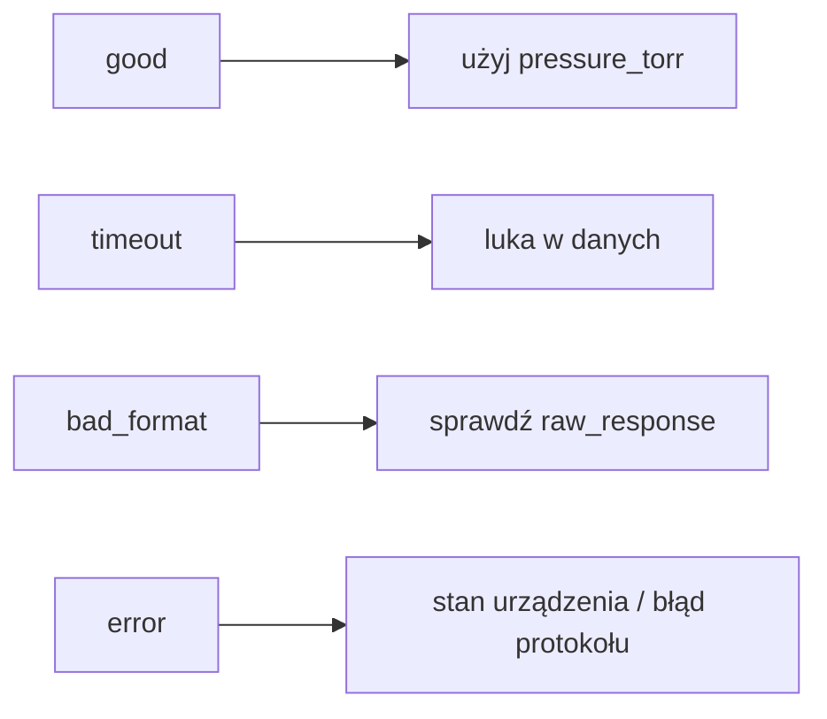
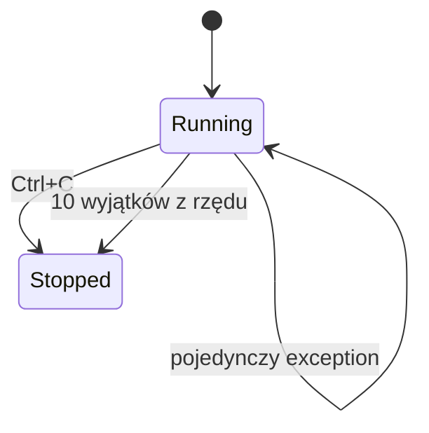

# Kolektor danych GP350 - jak działa

Kolektor pyta GP350 o ciśnienie komendą zgodną z instrukcją, mierzy czas
odpowiedzi, parsuje jedną linię ASCII i zapisuje wynik do CSV.



## Komenda pomiarowa

Komenda zależy od `module_type`:

```text
module_type = rs232   -> DS IG
module_type = digital -> RD
```

`DS IG` jest dla RS-232 Module. `RD` jest dla Digital Interface. Odpowiedź ma
postać samej liczby albo liczby z prefixem `*` przy RS-485:

```text
1.20E-07
```

Bez jednostki, bez statusu `ON`, bez przecinka.

`DGS` nie jest pomiarem. `DGS` zwraca status degas: `1` albo `0`.

## Pętla kolektora



## Konfiguracja serial

```ini
[Connection]
module_type = digital
serial_port = /dev/ttys005
baudrate = 9600
bytesize = 8
parity = none
stopbits = 1
line_terminator = cr
rs485_address =
timeout = 1.0
write_timeout = 1.0
```

Manual GP350 dopuszcza:

- `baudrate`: `75`, `150`, `300`, `600`, `1200`, `2400`, `4800`, `9600`, `19200`
- `bytesize`: `7` albo `8`
- `parity`: `none`, `even`, `odd`
- `stopbits`: `1` albo `2`
- `line_terminator`: `crlf`, `cr` albo `lf`

Starszy RS-232 Module fabrycznie: `300`, `7`, `none`, `2`.
Digital Interface fabrycznie: `9600`, `8`, `none`, `1`, terminator `CR`.

Jeśli usuniesz `baudrate`, `bytesize`, `parity`, `stopbits` albo `command`,
kolektor dobierze wartości z `module_type`.

RS-485:

```ini
[Connection]
module_type = digital
rs485_address = 1

[Collector]
command = RD
```

Kolektor wyśle wtedy:

```text
#01RD
```

## Parser



Obsługiwane poprawne odczyty:

```text
1.20E-07
* 1.20E-07
```

Obsługiwane błędy urządzenia:

```text
9.90E+09
OVERRUN ERROR
PARITY ERROR
SYNTAX ERROR
INVALID
? SYNTX ER
? PRITY ER
? OVERR ER
? RAM FAIL
? INVALID
```

## CSV

Nagłówek:

```text
timestamp,device,channel,pressure_torr,unit,quality,raw_response,latency_ms
```

Przykład:

```text
2026-06-24T12:00:00+00:00,GP350_1,IG1,1.2e-07,Torr,good,1.20E-07,12.346
```

`unit` jest ustawiane jako `Torr`, bo projekt zapisuje `pressure_torr`. Jeśli
urządzenie jest fizycznie przestawione na mbar albo pascal, trzeba zmienić
interpretację danych przed analizą.

## InfluxDB dla Grafany

CSV zostaje lokalnym backupem. InfluxDB jest opcjonalnym drugim outputem pod
Grafanę.

Minimalny config:

```ini
[InfluxDB]
enabled = true
url = http://localhost:8086
org = lab
bucket = gp350
token_env = INFLUXDB_TOKEN
measurement = gp350_reading
```

Szczegóły: `docs/influxdb_grafana.md`.

## Jakość rekordu



Znaczenie:

- `good`: poprawny odczyt ciśnienia.
- `timeout`: brak odpowiedzi.
- `bad_format`: odpowiedź nie pasuje do manualowego formatu ciśnienia.
- `error`: GP350 zwrócił błąd albo `9.90E+09`.

## Odporność

Pojedynczy zły pomiar nie zatrzymuje kolektora.



Przy zamkniętym porcie kolektor loguje wyjątek, próbuje dalej i kończy po
`10` błędach z rzędu.
