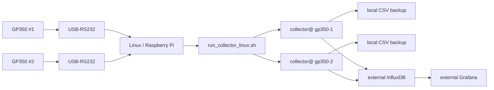
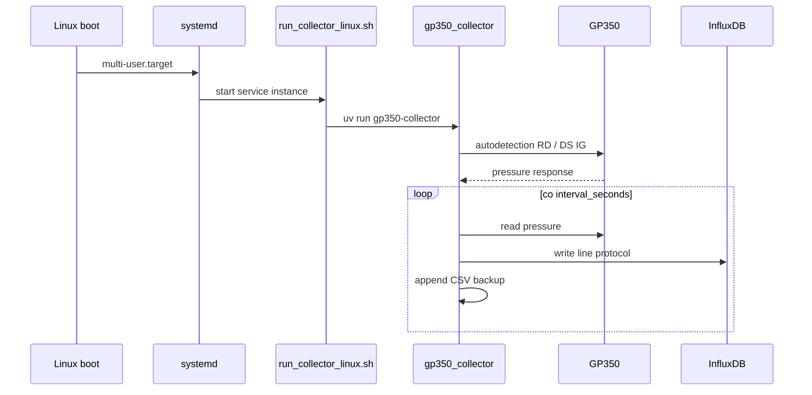

# Linux runner i autostart kolektora

Cel: urządzenie Linux/Raspberry Pi ma samo startować kolektor po boot, wykrywać
GP350, zapisywać CSV i wysyłać dane do zewnętrznego InfluxDB, który potem czyta
Grafana.

## Architektura



Grafana nie dostaje danych bezpośrednio z kolektora. Kolektor pisze do
InfluxDB. Grafana czyta InfluxDB.

## Runtime

Używamy CPython 3.13 przez `uv`.

Dlaczego nie Cython/PyPy:

- pomiar jest wolny względem CPU, bo czeka na RS-232 i HTTP,
- proces działa długo, więc koszt startu Pythona nie ma znaczenia,
- największy zysk daje stabilny daemon i `systemd`, nie kompilowanie kodu.

## Pliki

- `scripts/run_collector_linux.sh` - uruchamia kolektor z absolutną ścieżką do configu.
- `systemd/vacuum-monitor-collector@.service` - autostart/restart.
- `scripts/install_linux_service.sh` - instaluje usługę.
- `config/examples/gp350-1.ini` - pierwszy GP350.
- `config/examples/gp350-2.ini` - drugi GP350.
- `config/examples/collector.env.example` - token InfluxDB.

## Instalacja na Linux/Raspberry Pi

Założenie: projekt jest w:

```bash
/opt/vacuum-instrument-monitor
```

Instalacja zależności:

```bash
sudo apt-get update
sudo apt-get install -y git curl
curl -LsSf https://astral.sh/uv/install.sh | sudo env UV_INSTALL_DIR=/usr/local/bin sh
cd /opt/vacuum-instrument-monitor
uv sync --no-dev
```

Sekrety:

```bash
sudo mkdir -p /etc/vacuum-monitor
sudo cp config/examples/collector.env.example /etc/vacuum-monitor/collector.env
sudo nano /etc/vacuum-monitor/collector.env
```

Wpisz:

```bash
INFLUXDB_TOKEN=twój_token_write_do_influxdb
UV_BIN=/usr/local/bin/uv
PYTHON_VERSION=3.13
```

Configi:

```bash
sudo cp config/examples/gp350-1.ini /etc/vacuum-monitor/gp350-1.ini
sudo cp config/examples/gp350-2.ini /etc/vacuum-monitor/gp350-2.ini
```

W obu plikach zmień:

```ini
[InfluxDB]
url = https://twoj-influx.example.com
org = lab
bucket = vacuum
```

## Test ręczny

Najpierw wykrywanie:

```bash
/opt/vacuum-instrument-monitor/scripts/run_collector_linux.sh \
  /etc/vacuum-monitor/gp350-1.ini \
  --discover
```

Potem start jednego kolektora:

```bash
/opt/vacuum-instrument-monitor/scripts/run_collector_linux.sh \
  /etc/vacuum-monitor/gp350-1.ini
```

## Autostart systemd

Pierwszy GP350:

```bash
sudo /opt/vacuum-instrument-monitor/scripts/install_linux_service.sh gp350-1
```

Drugi GP350:

```bash
sudo /opt/vacuum-instrument-monitor/scripts/install_linux_service.sh gp350-2
```

Status:

```bash
systemctl status vacuum-monitor-collector@gp350-1.service
systemctl status vacuum-monitor-collector@gp350-2.service
```

Logi:

```bash
journalctl -u vacuum-monitor-collector@gp350-1.service -f
journalctl -u vacuum-monitor-collector@gp350-2.service -f
```

Restart:

```bash
sudo systemctl restart vacuum-monitor-collector@gp350-1.service
```

Wyłączenie autostartu:

```bash
sudo systemctl disable --now vacuum-monitor-collector@gp350-1.service
```

## Zewnętrzna Grafana

Grafana musi mieć datasource do tego samego InfluxDB:

- Influx URL: taki sam jak w `config.ini`
- org: taki sam
- bucket: taki sam
- token: może być read-only

Kolektor potrzebuje tokenu write. Grafana najlepiej token read.

## Typowy flow po boot



## Gdy port USB zmieni nazwę

Nie szkodzi, jeśli config ma:

```ini
[Connection]
module_type = auto
serial_port = auto
```

Po restarcie usługi kolektor znowu wykryje port.
