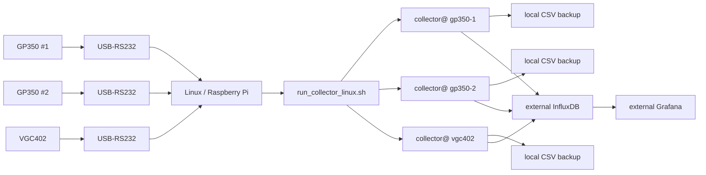
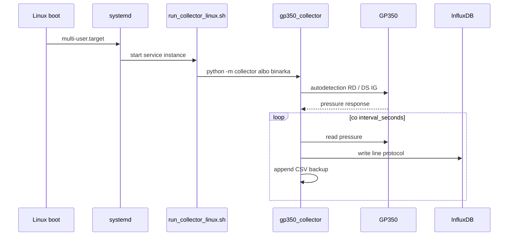

# Linux runner i autostart kolektora

Cel: urządzenie Linux/Raspberry Pi ma samo startować kolektor po boot, wykrywać
GP350 albo INFICON VGC402, zapisywać CSV i wysyłać dane do zewnętrznego
InfluxDB, który potem czyta Grafana.

## Architektura



Grafana nie dostaje danych bezpośrednio z kolektora. Kolektor pisze do
InfluxDB. Grafana czyta InfluxDB.

## Runtime

Najprostszy runtime: CPython 3.11+ przez `uv` albo gotowa binarka PyInstaller.

Dlaczego nie Cython/PyPy:

- pomiar jest wolny względem CPU, bo czeka na RS-232 i HTTP,
- proces działa długo, więc koszt startu Pythona nie ma znaczenia,
- największy zysk daje stabilny daemon i `systemd`, nie kompilowanie kodu.

Najlżejszy wariant na produkcji: zbudować binarkę PyInstaller na Linux/RPi i
odpalać ją przez `systemd`. Wtedy na docelowym systemie nie potrzeba `uv`, `pip`
ani `.venv`.

## Pliki

- `scripts/run_collector_linux.sh` - uruchamia kolektor z absolutną ścieżką do configu.
- `scripts/build_linux_binary.sh` - buduje binarkę PyInstaller na Linux.
- `scripts/run_collector_binary_linux.sh` - odpala gotową binarkę.
- `scripts/check_linux_binary.sh` - sprawdza binarkę na docelowym Linux/ARM.
- `systemd/vacuum-monitor-collector@.service` - autostart/restart.
- `systemd/vacuum-monitor-collector-binary@.service` - autostart dla binarki.
- `scripts/install_linux_service.sh` - instaluje usługę.
- `scripts/install_linux_binary_service.sh` - buduje binarkę i instaluje usługę.
- `scripts/install_udev_rules.sh` - instaluje stabilne porty `/dev/vacuum-*`.
- `config/examples/gp350-1.ini` - pierwszy GP350.
- `config/examples/gp350-2.ini` - drugi GP350.
- `config/examples/vgc402.ini` - INFICON VGC402.
- `config/examples/collector.env.example` - token InfluxDB.
- `logrotate/vacuum-monitor` - rotacja plików z `logs/`.
- `udev/99-vacuum-monitor.rules.example` - szablon stabilnych portów.

## Instalacja na Linux/Raspberry Pi

Założenie: projekt jest w:

```bash
/opt/vacuum-instrument-monitor
```

Instalacja zależności:

```bash
sudo apt-get update
sudo apt-get install -y git curl
curl -LsSf https://astral.sh/uv/install.sh | sudo env UV_INSTALL_DIR=/usr/local/bin sh
cd /opt/vacuum-instrument-monitor
uv sync --no-dev
```

Sekrety:

```bash
sudo mkdir -p /etc/vacuum-monitor
sudo cp config/examples/collector.env.example /etc/vacuum-monitor/collector.env
sudo nano /etc/vacuum-monitor/collector.env
```

Wpisz:

```bash
INFLUXDB_TOKEN=twój_token_write_do_influxdb
UV_BIN=/usr/local/bin/uv
PYTHON_VERSION=3.11
```

Configi:

```bash
sudo cp config/examples/gp350-1.ini /etc/vacuum-monitor/gp350-1.ini
sudo cp config/examples/gp350-2.ini /etc/vacuum-monitor/gp350-2.ini
sudo cp config/examples/vgc402.ini /etc/vacuum-monitor/vgc402.ini
```

W obu plikach zmień:

```ini
[InfluxDB]
url = https://twoj-influx.example.com
org = lab
bucket = vacuum
```

## Test ręczny

Najpierw wykrywanie:

```bash
/opt/vacuum-instrument-monitor/scripts/run_collector_linux.sh \
  /etc/vacuum-monitor/gp350-1.ini \
  --discover
```

VGC402:

```bash
/opt/vacuum-instrument-monitor/scripts/run_collector_linux.sh \
  /etc/vacuum-monitor/vgc402.ini \
  --discover
```

Potem start jednego kolektora:

```bash
/opt/vacuum-instrument-monitor/scripts/run_collector_linux.sh \
  /etc/vacuum-monitor/gp350-1.ini
```

## Autostart systemd

Wariant z Python/uv:

Pierwszy GP350:

```bash
sudo /opt/vacuum-instrument-monitor/scripts/install_linux_service.sh gp350-1
```

Drugi GP350:

```bash
sudo /opt/vacuum-instrument-monitor/scripts/install_linux_service.sh gp350-2
```

VGC402:

```bash
sudo /opt/vacuum-instrument-monitor/scripts/install_linux_service.sh vgc402
```

Status:

```bash
systemctl status vacuum-monitor-collector@gp350-1.service
systemctl status vacuum-monitor-collector@gp350-2.service
systemctl status vacuum-monitor-collector@vgc402.service
```

Logi:

```bash
journalctl -u vacuum-monitor-collector@gp350-1.service -f
journalctl -u vacuum-monitor-collector@gp350-2.service -f
journalctl -u vacuum-monitor-collector@vgc402.service -f
```

Restart:

```bash
sudo systemctl restart vacuum-monitor-collector@gp350-1.service
```

Wyłączenie autostartu:

```bash
sudo systemctl disable --now vacuum-monitor-collector@gp350-1.service
```

## Binarka PyInstaller

Build musi powstać na tym samym typie Linuxa, na którym ma działać:

- Raspberry Pi 64-bit -> buduj na ARM64 Linux/Raspberry Pi.
- Raspberry Pi 32-bit -> buduj na armhf/ARMv7.
- x86_64 serwer -> buduj na x86_64 Linux.

Build onefile:

```bash
cd /opt/vacuum-instrument-monitor
scripts/build_linux_binary.sh --onefile --install /opt/vacuum-instrument-monitor/bin
```

Efekt:

```text
/opt/vacuum-instrument-monitor/bin/vacuum-collector
```

Test:

```bash
/opt/vacuum-instrument-monitor/bin/vacuum-collector \
  --config /etc/vacuum-monitor/gp350-1.ini \
  --discover
```

Szybki check binarki na Raspberry Pi:

```bash
scripts/check_linux_binary.sh /etc/vacuum-monitor/vgc402.ini
```

Autostart z binarki:

```bash
sudo /opt/vacuum-instrument-monitor/scripts/install_linux_binary_service.sh gp350-1
sudo /opt/vacuum-instrument-monitor/scripts/install_linux_binary_service.sh gp350-2
sudo /opt/vacuum-instrument-monitor/scripts/install_linux_binary_service.sh vgc402
```

Logi:

```bash
journalctl -u vacuum-monitor-collector-binary@gp350-1.service -f
journalctl -u vacuum-monitor-collector-binary@vgc402.service -f
```

Status:

```bash
systemctl status vacuum-monitor-collector-binary@gp350-1.service
systemctl status vacuum-monitor-collector-binary@vgc402.service
```

Restart:

```bash
sudo systemctl restart vacuum-monitor-collector-binary@gp350-1.service
```

## Stabilne porty udev

Autodetekcja działa, ale do produkcji warto nadać adapterom stałe nazwy:

```text
/dev/vacuum-gp350-1
/dev/vacuum-gp350-2
/dev/vacuum-vgc402
```

Kroki:

```bash
cp udev/99-vacuum-monitor.rules.example udev/99-vacuum-monitor.rules
udevadm info -q property -n /dev/ttyUSB0
nano udev/99-vacuum-monitor.rules
sudo scripts/install_udev_rules.sh /opt/vacuum-instrument-monitor/udev/99-vacuum-monitor.rules
```

Po przepięciu USB:

```bash
ls -l /dev/vacuum-*
```

W configu możesz wtedy użyć np.:

```ini
[Connection]
serial_port = /dev/vacuum-vgc402
```

## Logrotate

Instalatory `install_linux_service.sh` i `install_linux_binary_service.sh`
kopiują `logrotate/vacuum-monitor` do `/etc/logrotate.d/vacuum-monitor`.

`onefile` łatwo kopiować, ale startuje trochę wolniej. `onedir` startuje
szybciej, ale ma katalog z plikami:

```bash
scripts/build_linux_binary.sh --onedir --install /opt/vacuum-instrument-monitor/bin
```

## Automatyczny build na GitHub

Workflow:

```text
.github/workflows/build-linux-binary.yml
```

Co robi:

- `workflow_dispatch` buduje ręcznie po kliknięciu w GitHub Actions,
- tag `v*` buduje automatycznie release artifact,
- x86_64 buduje na `ubuntu-24.04`,
- ARM64 buduje na self-hosted runner z label `meterdevicepi`.

Ważne: binarka ARM64 dla Raspberry Pi musi powstać na ARM64 Linux. Artifact z
`ubuntu-24.04` działa na x86_64, nie na Raspberry Pi.

Jeśli `/tmp` ma `noexec`, `--onefile` może nie ruszyć, bo PyInstaller rozpakowuje
się do katalogu tymczasowego. Wtedy użyj:

```bash
scripts/build_linux_binary.sh --onedir --install /opt/vacuum-instrument-monitor/bin
```

## Zewnętrzna Grafana

Grafana musi mieć datasource do tego samego InfluxDB:

- Influx URL: taki sam jak w `config.ini`
- org: taki sam
- bucket: taki sam
- token: może być read-only

Kolektor potrzebuje tokenu write. Grafana najlepiej token read.

## Typowy flow po boot



## Gdy port USB zmieni nazwę

Nie szkodzi, jeśli config ma:

```ini
[Connection]
module_type = auto
serial_port = auto
```

Po restarcie usługi kolektor znowu wykryje port.
