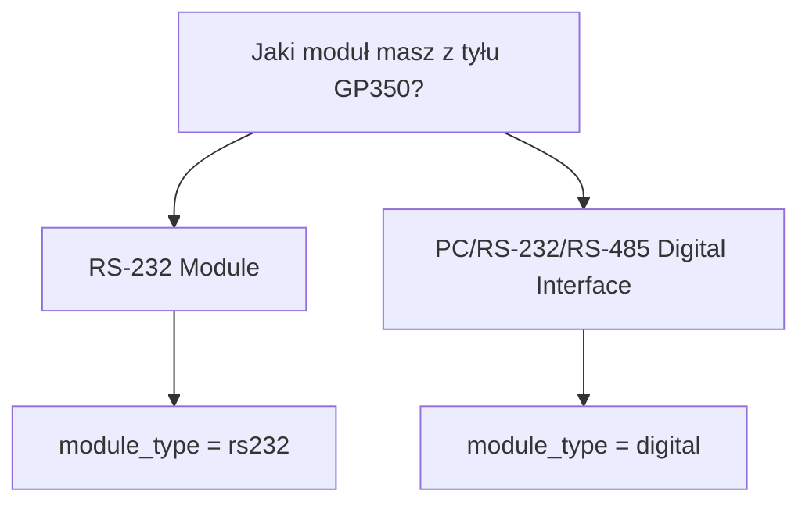

# Jak podłączyć prawdziwy GP350

Ten dokument jest praktyczną checklistą przed pierwszym odczytem z prawdziwego
Granville-Phillips 350.

## 1. Ustal moduł komunikacyjny



## 2. RS-232 Module

Fabryczne ustawienia z manuala:

```ini
[Connection]
module_type = rs232
baudrate = 300
bytesize = 7
parity = none
stopbits = 2
line_terminator = crlf

[Collector]
command = DS IG
```

Komenda pomiarowa:

```text
DS IG
```

Poprawna odpowiedź:

```text
1.20E-07
```

`DGS` nie mierzy ciśnienia. `DGS` pokazuje status degas.

## 3. Digital Interface RS-232

Fabryczne ustawienia z manuala:

```ini
[Connection]
module_type = digital
baudrate = 9600
bytesize = 8
parity = none
stopbits = 1
line_terminator = cr
rs485_address =

[Collector]
command = RD
```

Komenda pomiarowa:

```text
RD
```

## 4. Digital Interface RS-485

RS-485 używa adresu `0-31`. Kolektor sam zbuduje komendę `#AA...`.

Przykład dla adresu `1`:

```ini
[Connection]
module_type = digital
baudrate = 9600
bytesize = 8
parity = none
stopbits = 1
line_terminator = cr
rs485_address = 1

[Collector]
command = RD
```

Kolektor wyśle:

```text
#01RD
```

Poprawna odpowiedź ma prefix `*`:

```text
* 1.20E-07
```

## 5. Kabel i port

Na macOS port zwykle wygląda tak:

```text
/dev/cu.usbserial-XXXX
```

W configu:

```ini
[Connection]
serial_port = /dev/cu.usbserial-XXXX
```

Możesz też nadpisać port bez edycji configu:

```bash
uv run python -m collectors.gp350_collector --port /dev/cu.usbserial-XXXX
```

## 6. DIP switch / ustawienia fizyczne

Sprawdź w manualu:

- baudrate,
- data bits,
- parity,
- stop bits,
- RS-232 vs RS-485,
- adres RS-485,
- handshake lines.

Config musi pasować do switchy. Jeśli nie pasuje, typowe objawy:

- brak odpowiedzi,
- krzaki w odpowiedzi,
- `PARITY ERROR`,
- `OVERRUN ERROR`,
- `SYNTAX ERROR`.

## 7. Szybki test przed kolektorem

Terminal:

```bash
uv run python serial_terminal.py /dev/cu.usbserial-XXXX --baudrate 300 --bytesize 7 --parity none --stopbits 2 --line-terminator crlf
```

Wpisz:

```text
DS IG
```

Jeśli widzisz `1.20E-07` albo `9.90E+09`, komunikacja działa. Jeśli widzisz
timeout albo znaki losowe, sprawdź port, kabel i DIP switch.

Dla Digital Interface użyj terminatora `cr`:

```bash
uv run python serial_terminal.py /dev/cu.usbserial-XXXX --line-terminator cr
```

Dla RS-485 z adresem `1`:

```bash
uv run python serial_terminal.py /dev/cu.usbserial-XXXX --address 1 --line-terminator cr
```

## 8. Interpretacja `9.90E+09`

`9.90E+09` nie jest realnym ciśnieniem. GP350 używa tego jako sygnału, że nie ma
poprawnego odczytu, np. ion gauge jest wyłączony albo dopiero startuje.

Kolektor zapisze:

```text
quality=error
pressure_torr=
raw_response=9.90E+09
```
