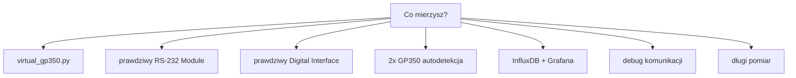

# Scenariusze ustawień kolektora GP350

Gotowe ustawienia do `config/config.ini`. Wszystkie używają komend zgodnych z
manualem GP350.



## 1. Test z `virtual_gp350.py`

```ini
[Connection]
module_type = digital
serial_port = /dev/ttys005
baudrate = 9600
bytesize = 8
parity = none
stopbits = 1
line_terminator = cr
rs485_address =
timeout = 1.0
write_timeout = 1.0

[Collector]
interval_seconds = 1.0

[File]
csv_filepath = data/sim_test.csv
csv_mode = overwrite
log_file = logs/sim_test.log
```

## 1A. Dwa GP350 przez USB-RS232, autodetekcja

Najpierw sprawdź, co wykrywa skaner:

```bash
uv run python -m collectors.gp350_collector --discover
```

Pierwszy kolektor:

```ini
[Connection]
module_type = auto
serial_port = auto

[Detection]
device_index = 0
scan_rs485 = false

[Device]
device_name = GP350_CHAMBER
channel = IG1

[File]
csv_filepath = data/gp350_chamber.csv
```

Drugi kolektor:

```ini
[Connection]
module_type = auto
serial_port = auto

[Detection]
device_index = 1
scan_rs485 = false

[Device]
device_name = GP350_LOADLOCK
channel = IG1

[File]
csv_filepath = data/gp350_loadlock.csv
```

Szczegóły: `docs/autodetekcja_urzadzen.md`.

## 2. Prawdziwy GP350 - RS-232 Module

Fabryczne ustawienia z manuala: `300 baud`, `7 data bits`, `none parity`,
`2 stop bits`.

```ini
[Connection]
module_type = rs232
serial_port = /dev/cu.usbserial-XXXX
line_terminator = crlf
timeout = 1.0
write_timeout = 1.0

[Collector]
interval_seconds = 1.0
```

Odpowiedź poprawna:

```text
1.20E-07
```

## 3. Prawdziwy GP350 - Digital Interface

Fabryczne ustawienia z manuala: `9600 baud`, `8 data bits`, `none parity`,
`1 stop bit`.

```ini
[Connection]
module_type = digital
serial_port = /dev/cu.usbserial-XXXX
line_terminator = cr
timeout = 1.0
write_timeout = 1.0

[Collector]
interval_seconds = 1.0
```

## 4. Prawdziwy GP350 - Digital Interface RS-485

Przykład: adres urządzenia `1`.

```ini
[Connection]
module_type = digital
serial_port = /dev/cu.usbserial-XXXX
rs485_address = 1
line_terminator = cr

[Collector]
command = RD
interval_seconds = 1.0
```

Kolektor wyśle `#01RD`, a parser przyjmie odpowiedź z prefixem `*`.

## 5. InfluxDB + Grafana

```ini
[InfluxDB]
enabled = true
url = http://localhost:8086
org = lab
bucket = gp350
token_env = INFLUXDB_TOKEN
measurement = gp350_reading
timeout = 2.0
retries = 1
fail_on_error = false
```

Uruchom przed kolektorem:

```bash
export INFLUXDB_TOKEN="..."
```

Grafana query i panele: `docs/influxdb_grafana.md`.

## 6. Debug komunikacji

```ini
[General]
debug = true
log_level = debug

[File]
csv_filepath = data/debug_run.csv
csv_mode = overwrite
log_file = logs/debug_run.log
```

Używaj, gdy `quality` często jest `timeout`, `bad_format` albo `error`.

## 7. Długi pomiar

```ini
[Collector]
interval_seconds = 10.0

[File]
csv_filepath = data/long_run.csv
csv_mode = append
log_file = logs/long_run.log
```

Mniej danych, łatwiejszy pomiar nocny.

## 8. Każdy start czyści CSV

```ini
[File]
csv_filepath = data/current_run.csv
csv_mode = overwrite
```

Plik powstaje od razu przy starcie kolektora.

## 9. Historia w jednym CSV

```ini
[File]
csv_filepath = data/gp350_history.csv
csv_mode = append
```

Nowe pomiary dopisywane na końcu. Pilnuj `device_name` i `channel`, jeśli
mieszasz wiele urządzeń.

## 10. Kiedy nie używać `DGS`

`DGS` nie mierzy ciśnienia. To status degas.

```text
DGS -> 0
DGS -> 1
```

Do CSV z ciśnieniem używaj:

- `DS IG` dla RS-232 Module
- `RD` dla Digital Interface
