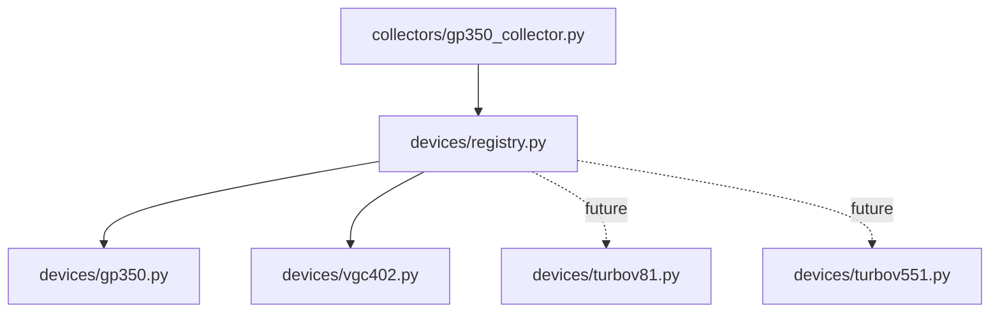

# Warstwa urządzeń

Cel: kolektor ma zbierać dane z wielu rodzin sprzętu bez mieszania protokołów w
jednym pliku.



## Co robi profil urządzenia

Każdy profil odpowiada za:

- wysłanie komendy przez właściwy protokół,
- odczyt ustawień runtime z urządzenia, jeśli trzeba,
- parsowanie odpowiedzi,
- zamianę jednej odpowiedzi na jeden albo wiele rekordów,
- nadanie nazw kanałów.

## GP350

Plik:

```text
devices/gp350.py
```

Używa zwykłego serial:

```text
command -> response
```

Przykład:

```text
RD -> 1.23E-06
```

## INFICON VGC402

Plik:

```text
devices/vgc402.py
```

Używa handshake z manuala:

```text
command -> ACK
ENQ     -> data
```

Dodatkowo:

- `pressure_unit = auto` wysyła `UNI`,
- `PRX` tworzy rekordy `CH1`, `CH2`.

## Jak dodać kolejne urządzenie

1. Dodaj `devices/new_device.py`.
2. Zaimplementuj metody z `devices/base.py`.
3. Dodaj profil do `devices/registry.py`.
4. Dodaj probe do `collectors/device_discovery.py`.
5. Dodaj config example.
6. Dodaj test parsera, autodetekcji i integracji.

Turbo-V 81-AG i Turbo-V 551 HT powinny wejść tą drogą, bez dopisywania ich
protokołu bezpośrednio do głównej pętli kolektora.
